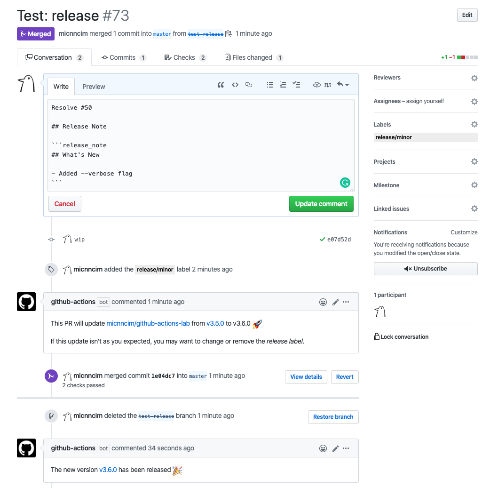
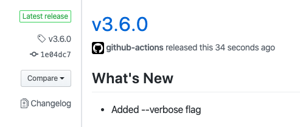
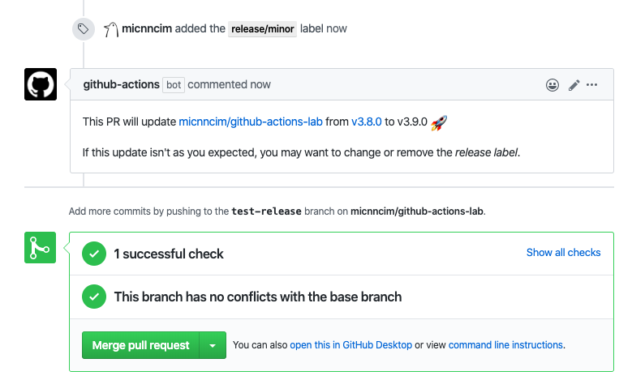
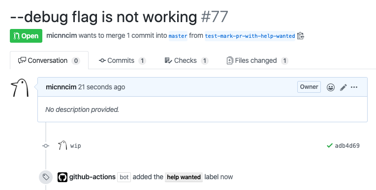
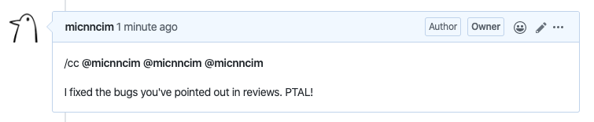
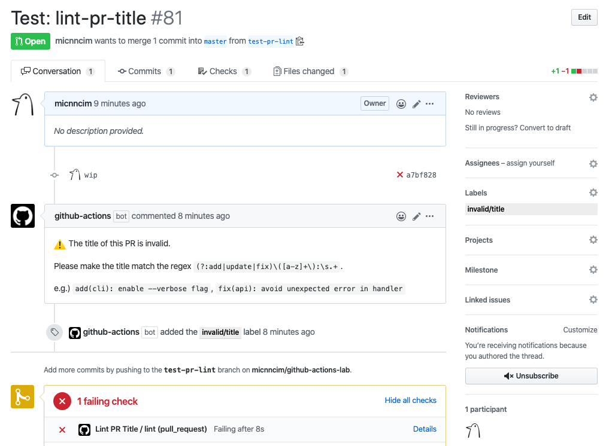
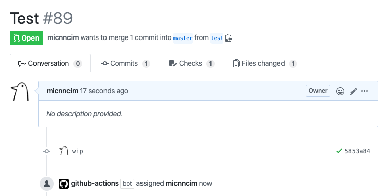

# Recipes

[![license][license-badge]][license]

This repository contains some use cases of workflows with [Actions Ecosystem](https://github.com/actions-ecosystem)'s GitHub Actions.

Actions Ecosystem's actions are designed to do one thing well as Unix Philosophy.
That's why it's further better to use an action with other actions.

Let's say we want a workflow that lints source code and send the result to Slack channel.
In this case, we prefer to use a `lint action` and a `Slack action`, rather than a `lint and Slack action`.
This is because if we use a `lint and Slack action` and want a workflow that *tests* source code and send the result to Slack channel then we need to develop the same Slack notification logic again.
We prefer to use GitHub Actions' output parameters that work as pipelines between actions.
And also, even if you prefer to use an action not in Actions Ecosystem in your workflow, some of Actions Ecosystem's actions help you as a part of your workflow.

If you're not so familiar with GitHub Actions, first of all you may want to read [GitHub Actions Documentation](https://help.github.com/en/actions).

If you're interested in the latest ones, explore `.github/workflows` in Actions Ecosystem's repositories.

## Automate updating a Git tag with semver and creating a GitHub release

This workflow automates updating a Git tag and creating a GitHub release with only adding a *release label* and optionally a *release note* after a pull request has been merged.




<details>
<summary>Configuration</summary>

1. [actions-ecosystem/action-get-merged-pull-request](https://github.com/actions-ecosystem/action-get-merged-pull-request) gets a pull request merged with the base branch.
2. [actions-ecosystem/action-release-label](https://github.com/actions-ecosystem/action-release-label) gets a semver update level from a *release label*.
3. [actions-ecosystem/action-get-latest-tag](https://github.com/actions-ecosystem/action-get-latest-tag) fetches the latest Git tag in the repository.
4. [actions-ecosystem/action-bump-semver](https://github.com/actions-ecosystem/action-bump-semver) bumps up the Git tag previously fetched based on the semver update level at the step *1*.
5. *[Optional]* [actions-ecosystem/action-regex-match](https://github.com/actions-ecosystem/action-regex-match) extracts a *release note* from the pull request body.
6. [actions-ecosystem/action-push-tag](https://github.com/actions-ecosystem/action-push-tag) pushes the bumped Git tag with the pull request reference as a message.
7. [actions/create-release](https://github.com/actions/create-release) creates a GitHub release with the Git tag and the *release note* when the semver update level is *major* or *minor*.
8. *[Optional]* [actions-ecosystem/action-create-comment](https://github.com/actions-ecosystem/action-create-comment) creates a comment that reports the new GitHub release.

For further details, see each action document.

```yaml
name: Create Release

on:
  push:
    branches:
      - master

jobs:
  release:
    runs-on: ubuntu-latest
    steps:
      - uses: actions/checkout@v2

      - uses: actions-ecosystem/action-get-merged-pull-request@v1
        id: get-merged-pull-request
        with:
          github_token: ${{ secrets.GITHUB_TOKEN }}

      - uses: actions-ecosystem/action-release-label@v1
        id: release-label
        if: ${{ steps.get-merged-pull-request.outputs.title != null }}
        with:
          labels: ${{ steps.get-merged-pull-request.outputs.labels }}

      - uses: actions-ecosystem/action-get-latest-tag@v1
        id: get-latest-tag
        if: ${{ steps.release-label.outputs.level != null }}
        with:
          semver_only: true

      - uses: actions-ecosystem/action-bump-semver@v1
        id: bump-semver
        if: ${{ steps.release-label.outputs.level != null }}
        with:
          current_version: ${{ steps.get-latest-tag.outputs.tag }}
          level: ${{ steps.release-label.outputs.level }}

      - uses: actions-ecosystem/action-regex-match@v2
        id: regex-match
        if: ${{ steps.bump-semver.outputs.new_version != null }}
        with:
          text: ${{ steps.get-merged-pull-request.outputs.body }}
          regex: '```release_note([\s\S]*)```'

      - uses: actions-ecosystem/action-push-tag@v1
        if: ${{ steps.bump-semver.outputs.new_version != null }}
        with:
          tag: ${{ steps.bump-semver.outputs.new_version }}
          message: "${{ steps.bump-semver.outputs.new_version }}: PR #${{ steps.get-merged-pull-request.outputs.number }} ${{ steps.get-merged-pull-request.outputs.title }}"

      - uses: actions/create-release@v1
        if: ${{ steps.release-label.outputs.level == 'major' || steps.release-label.outputs.level == 'minor' }}
        env:
          GITHUB_TOKEN: ${{ secrets.GITHUB_TOKEN }}
        with:
          tag_name: ${{ steps.bump-semver.outputs.new_version }}
          release_name: ${{ steps.bump-semver.outputs.new_version }}
          body: ${{ steps.regex-match.outputs.group1 }}

      - uses: actions-ecosystem/action-create-comment@v1
        if: ${{ steps.bump-semver.outputs.new_version != null }}
        with:
          github_token: ${{ secrets.GITHUB_TOKEN }}
          number: ${{ steps.get-merged-pull-request.outputs.number }}
          body: |
            The new version [${{ steps.bump-semver.outputs.new_version }}](https://github.com/${{ github.repository }}/releases/tag/${{ steps.bump-semver.outputs.new_version }}) has been released :tada:
```

</details>

## Check release status

This workflow tells you what version will be released with the pull request.

*It requires the [release workflow](#automate-updating-a-git-tag-with-semver-and-creating-a-github-release) above.*



<details>
<summary>Configuration</summary>

```yaml
name: Check Release

on:
  pull_request:
    types:
      - labeled

jobs:
  release:
    runs-on: ubuntu-latest
    steps:
      - uses: actions/checkout@v2

      - uses: actions-ecosystem/action-release-label@v1
        id: release-label
        if: ${{ startsWith(github.event.label.name, 'release/') }}

      - uses: actions-ecosystem/action-get-latest-tag@v1
        id: get-latest-tag
        if: ${{ steps.release-label.outputs.level != null }}
        with:
          semver_only: true

      - uses: actions-ecosystem/action-bump-semver@v1
        id: bump-semver
        if: ${{ steps.release-label.outputs.level != null }}
        with:
          current_version: ${{ steps.get-latest-tag.outputs.tag }}
          level: ${{ steps.release-label.outputs.level }}

      - uses: actions-ecosystem/action-create-comment@v1
        if: ${{ steps.bump-semver.outputs.new_version != null }}
        with:
          github_token: ${{ secrets.GITHUB_TOKEN }}
          body: |
            This PR will update [${{ github.repository }}](https://github.com/${{ github.repository }}) from [${{ steps.get-latest-tag.outputs.tag }}](https://github.com/${{ github.repository }}/releases/tag/${{ steps.get-latest-tag.outputs.tag }}) to ${{ steps.bump-semver.outputs.new_version }} :rocket:

            If this update isn't as you expected, you may want to change or remove the *release label*.
```

</details>

## Add suitable labels to a issue based on the information

This workflow adds a `help wanted` label to an issue whose title matches the regex `help|not work`.



<details>
<summary>Configuration</summary>

```yaml
name: Mark Issue with Help Wanted

on:
  issues:
    types:
      - opened
      - edited
      - reopened

jobs:
  release:
    runs-on: ubuntu-latest
    steps:
      - uses: actions/checkout@v2

      - uses: actions-ecosystem/action-regex-match@v2
        id: regex-match
        with:
          text: ${{ github.event.issue.title }}
          regex: "help|not work"
          flags: 'gi'

      - uses: actions-ecosystem/action-add-labels@v1
        if: ${{ steps.regex-match.outputs.match != '' }}
        with:
          github_token: ${{ secrets.GITHUB_TOKEN }}
          labels: 'help wanted'
```

</details>

## Propagate mentions from GitHub to Slack




<details>
<summary>Configuration</summary>

```yaml
name: Propagate Mentions

on:
  issue_comment:
    types:
      - created

jobs:
  notify:
    runs-on: ubuntu-latest
    steps:
      - uses: actions-ecosystem/action-regex-match@v2
        id: regex-match
        with:
          regex: '^\/cc(( +@[-\w]+)+)\s*$'
          text: ${{ github.event.comment.body }}
          flags: 'gm'

      - uses: actions-ecosystem/action-slack-notifier@v1
        if: ${{ steps.regex-match.outputs.match != '' }}
        with:
          slack_token: ${{ secrets.SLACK_TOKEN }}
          message: |
            ${{ steps.regex-match.outputs.match }}
          channel: develop
          color: blue # optional
          verbose: true # optional
```

</details>

## Lint the title of a pull request

This workflow lints the title of a pull request.



<details>
<summary>Configuration</summary>

```yaml
name: Lint Pull Request Title

on:
  pull_request:
    types:
      - opened
      - edited
      - reopened

jobs:
  lint:
    runs-on: ubuntu-latest
    steps:
      - uses: actions/checkout@v2

      - uses: actions-ecosystem/action-regex-match@v2
        id: regex-match
        with:
          text: ${{ github.event.pull_request.title }}
          regex: '(?:add|update|fix)\([a-z]+\):\s.+'

      - uses: actions-ecosystem/action-create-comment@v1
        if: ${{ steps.regex-match.outputs.match == '' }}
        with:
          github_token: ${{ secrets.GITHUB_TOKEN }}
          body: |
            :warning: The title of this PR is invalid.

            Please make the title match the regex `(?:add|update|fix)\([a-z]+\):\s.+`.

            e.g.) `add(cli): enable --verbose flag`, `fix(api): avoid unexpected error in handler`

      - uses: actions-ecosystem/action-add-labels@v1
        if: ${{ steps.regex-match.outputs.match == '' }}
        with:
          github_token: ${{ secrets.GITHUB_TOKEN }}
          labels: 'invalid/title'

      - run: exit 1
        if: ${{ steps.regex-match.outputs.match == '' }}
```

</details>

## Automatically assign the user who creates an issue or a pull request



<details>
<summary>Configuration</summary>

```yaml
name: Auto Assign

on:
  pull_request:
    types:
      - opened
      - reopened

jobs:
  add_labels:
    runs-on: ubuntu-latest
    steps:
      - uses: actions-ecosystem/action-add-assignees@v1
        with:
          github_token: ${{ secrets.github_token }}
          assignees: ${{ github.actor }}
```

</details>

## License

Copyright 2020 The Actions Ecosystem Authors.

<!-- badge links -->

[license]: LICENSE
[license-badge]: https://img.shields.io/github/license/actions-ecosystem/action-add-labels?style=for-the-badge
